# CLAUDE.md

This file provides guidance to Claude Code (claude.ai/code) when working with code in this repository.

## Project

**ForgeRhythm** — 純前端瀏覽器節奏遊戲，使用 MediaPipe 即時姿態偵測，將使用者拍打大腿的動作轉換為鼓聲。

## Development

**無建置步驟**：直接以瀏覽器開啟 `index.html`，或使用 VS Code Live Server。

```
# 開發時直接開啟，或用 Live Server
# webcam 需要 HTTPS 或 localhost（http://127.0.0.1 亦可）
```

無 `package.json`、無 bundler、無 linter 設定——所有 JS 均為原生 ES modules。程式碼格式化由 Prettier 在存檔/貼上時自動套用（`.vscode/settings.json` 已設定）。

## Architecture

入口：`index.html` → `<script type="module" src="./src/main.js">`

```
src/
├── main.js              ← 唯一的 app 組合點，持有共用 state 物件
├── camera.js            ← webcam 生命週期（start/stop/resize/canvas sync）
├── audioEngine.js       ← Web Audio API，載入 WAV buffer，playZone() 觸發音效
├── ui.js                ← 設定面板、音效 rack、命中顯示（純 DOM 操作）
├── mediaPanel.js        ← YouTube IFrame API + MIDI Library API 整合
└── poseEngine/
    ├── Mediapipe/poseLandmarker.js   ← 初始化 MediaPipe PoseLandmarker（GPU, full model）
    ├── math.js                        ← 數學工具（PF 計算、手部/膝蓋運動摘要）
    ├── calibration.js                 ← 六階段校準引擎（狀態機）
    ├── calibrationProfile.js          ← session JSON → 動態閾值 profile
    ├── poseLoop.js                    ← 每幀主迴圈（EMA 平滑、zone 鎖定、命中判斷）
    ├── conditions.js                  ← 手部/膝蓋命中條件邏輯
    └── hitEffects.js                  ← Canvas 視覺特效（與偵測邏輯解耦）
```

### 共用 state 物件

`main.js` 建立單一 `state` 物件，合併 app 狀態（`running`、`stream`、`poseLandmarker`、`outputGain`）與 `createInitialPoseState()` 的 poseLoop 狀態。`resetPoseState()` 重置時會保留 `USER_PREFERENCE_KEYS`（`calibrationProfile`、`visibilityThreshold`、`drawPoseDebugEnabled`、`showPFOverlay`）。

### 偵測核心概念

**PF（Perpendicular Foot distance）**：手部基準點（食指根 + 小指根中點）到大腿線段（hip→knee）的垂直距離，除以大腿長度正規化。PF=0 表示手貼在大腿上，是整個系統的核心判斷指標。

**Hit zones**：`left/right` × `front/outer`（手部打擊）；`left/right heel`（膝蓋踢）。

**Zone locking**：手部 PF 低於 `PF_RELEASE_UNIFIED` 時，對 `handHistory` 做方向分析並鎖定 zone，直到 PF 回升後才解鎖。防止在 front/outer 邊界來回觸發。

**膝蓋上升補償**：提膝時大腿線旋轉使 PF 幾何漂移，`calcKneeRisingAdj()` 計算補償量同步疊加到 `PF_HIT` 和 `PF_RELEASE`，防止誤觸發。

### 校準流程

```
calibration.start()
  ↓
FRONT_SNAPSHOT (6s) → STRIKING right_front (3下) → STRIKING left_front (3下)
  ↓
OUTER_SNAPSHOT (6s) → STRIKING right_outer (3下) → STRIKING left_outer (3下)
  ↓
DONE → buildCalibrationProfile(session) → state.calibrationProfile
```

`state.calibrationProfile = null` 時，手部/膝蓋打擊偵測及音效全部停用。校準完成前無法觸發命中。

校準閾值推導係數（`calibrationProfile.js` 頂層 TUNING 常數）：
- K1=2.0, K2=2.0（PF_HIT / PF_RELEASE 係數）
- K3=0.30（速度門檻係數）
- K4=0.80（冷卻時間係數）
- K_KNEE=1.8（膝蓋補償係數）

### MediaPipe 設定

模型使用本地檔案（`Model/pose_landmarker_full.task`），WASM 從 CDN 載入：
```javascript
"https://cdn.jsdelivr.net/npm/@mediapipe/tasks-vision@0.10.11/wasm"
```
GPU delegate，最低可見度 0.35（偵測）/0.25（追蹤），偵測 1 人。

### 音效系統

WAV 檔案存放於 `sounds/`，以 Web Audio API 的 `AudioBufferSourceNode` 零延遲播放。每次命中建立新的 source node（不重複使用）。`zoneSound` 物件（`left_front`、`right_outer` 等為 key）決定各 zone 播放哪個音效 id，可在 UI 音效 rack 即時切換。

### poseLoop.js 每幀執行流程

```mermaid
flowchart TD
    START([predictWebcam 啟動]) --> A

    A{poseLandmarker 存在?}
    A -- 否 --> DONE0([返回])
    A -- 是 --> B{runningMode = VIDEO?}
    B -- 否 --> C[setOptions VIDEO 模式]
    B -- 是 --> D
    C --> D[取得 videoTimeSec / webTimeMs]
    D --> E{videoTimeSec 有變化?}
    E -- 否 --> RAF_SKIP([requestAnimationFrame → 下一幀])
    E -- 是 --> F[detectForVideo 呼叫骨架偵測]

    subgraph DETECT_CB [detectForVideo callback]
        direction TD
        F1[清空 canvas] --> F2{有偵測到人?}
        F2 -- 否 --> DONE1([結束幀])
        F2 -- 是 --> F3[解析骨架關鍵點\nHip 23·24 / Knee 25·26\n手部基準點 L·R]

        F3 --> F4[onFrame callback]
        F4 --> F5{drawPoseDebugEnabled?}
        F5 -- 是 --> F6[drawPoseLandmarks 骨架可視化]
        F5 -- 否 --> F7
        F6 --> F7{skipPoints\n可見度 < threshold?}
        F7 -- 是 --> F8[clearTrackingHistory\n重置所有 history + EMA]
        F8 --> DONE2([結束幀])
        F7 -- 否 --> F9

        subgraph SMOOTH [平滑與 PF 計算]
            direction TD
            F9[Hip / Knee EMA 平滑 α=0.6] --> F10{drawPoseDebugEnabled?}
            F10 -- 否 --> F11[drawPose 畫關鍵點]
            F10 -- 是 --> F12
            F11 --> F12[計算 dtSec / 更新 preSec]
            F12 --> F13[thighLineDistance\n用平滑 Hip/Knee 計算左右 PF]
            F13 --> F14{showPFOverlay?}
            F14 -- 是 --> F15[drawPFOverlay\n每 100ms 節流顯示 PF 數值]
            F14 -- 否 --> F16
            F15 --> F16[計算左右手速度\nhypot dx·dy / dtSec]
        end

        F16 --> G1[pushPointHistory 左手 / 右手]
        G1 --> G2[pushPointHistory 左膝 / 右膝]
        G2 --> G3{calibrationProfile 存在?}
        G3 -- 否 --> HIT_PROC_START

        subgraph CALIB_BLOCK [校準 Profile 偵測區塊]
            direction TD
            G4[calcKneeRisingAdj\n計算左右膝蓋上升補償量] --> RZ1

            subgraph ZONE_R [右手 Zone 管理]
                direction TD
                RZ1{rightPF > PF_RELEASE + kneeAdj?}
                RZ1 -- 是 --> RZ2{rightState.canHit = false?}
                RZ2 -- 是 --> RZ3[清空 rightHandHistory\n解鎖 rightZoneLocked]
                RZ2 -- 否 --> RZ_END
                RZ3 --> RZ_END
                RZ1 -- 否 --> RZ4{rightZoneLocked?}
                RZ4 -- 是 --> RZ_END
                RZ4 -- 否 --> RZ5[summarizeHandMotion\npickHandZoneByWindow\n鎖定 rightLockedZone]
                RZ5 --> RZ_END([右手 zone 完成])
            end

            RZ_END --> LZ1

            subgraph ZONE_L [左手 Zone 管理]
                direction TD
                LZ1{leftPF > PF_RELEASE + kneeAdj?}
                LZ1 -- 是 --> LZ2{leftState.canHit = false?}
                LZ2 -- 是 --> LZ3[清空 leftHandHistory\n解鎖 leftZoneLocked]
                LZ2 -- 否 --> LZ_END
                LZ3 --> LZ_END
                LZ1 -- 否 --> LZ4{leftZoneLocked?}
                LZ4 -- 是 --> LZ_END
                LZ4 -- 否 --> LZ5[summarizeHandMotion\npickHandZoneByWindow\n鎖定 leftLockedZone]
                LZ5 --> LZ_END([左手 zone 完成])
            end

            LZ_END --> HH1[monitoringTriggerConditions 右手\nPF_HIT + kneeAdj · SPEED_HIT · COOLDOWN_MS]
            HH1 --> HH2[monitoringTriggerConditions 左手\nPF_HIT + kneeAdj · SPEED_HIT · COOLDOWN_MS]
            HH2 --> KM1[summarizeKneeMotion 左膝 / 右膝]
            KM1 --> KM2{leftKneeMetrics 有結果?}
            KM2 -- 是 --> KM3[monitoringKneeKickConditions 左膝]
            KM2 -- 否 --> KM4
            KM3 --> KM4{rightKneeMetrics 有結果?}
            KM4 -- 是 --> KM5[monitoringKneeKickConditions 右膝]
            KM4 -- 否 --> CALIB_END
            KM5 --> CALIB_END([校準偵測完成])
        end

        G3 -- 是 --> G4
        CALIB_END --> HIT_PROC_START

        subgraph HIT_PROC [命中結果處理]
            direction TD
            HIT_PROC_START{leftState.didHit?}
            HIT_PROC_START -- 是 --> LH1[playZone 左手音效\nframeHits.push source=hand\n_fx.pushHandHit strength=speed×2\n解鎖 leftZone]
            HIT_PROC_START -- 否 --> RH0
            LH1 --> RH0{rightState.didHit?}
            RH0 -- 是 --> RH1[playZone 右手音效\nframeHits.push source=hand\n_fx.pushHandHit strength=speed×2\n解鎖 rightZone]
            RH0 -- 否 --> LK0
            RH1 --> LK0{leftKneeState.didHit?}
            LK0 -- 是 --> LK1[playZone 左膝音效\nframeHits.push source=knee\n_fx.pushKneeHit strength=0.85]
            LK0 -- 否 --> RK0
            LK1 --> RK0{rightKneeState.didHit?}
            RK0 -- 是 --> RK1[playZone 右膝音效\nframeHits.push source=knee\n_fx.pushKneeHit strength=0.85]
            RK0 -- 否 --> CB
            RK1 --> CB{frameHits.length > 0?}
            CB -- 是 --> CB1[onHit callback]
            CB -- 否 --> FX
            CB1 --> FX[_fx.draw 繪製視覺特效]
            FX --> FINAL[更新 prevLeftKnee / prevRightKnee]
        end
    end

    F --> F1
    FINAL --> RAF([requestAnimationFrame → 下一幀])
    RAF --> START
```



## 重要檔案參考

- `note/calibration-session-schema.md`：校準 session JSON 格式完整說明
- `log/`：過去的校準 session 範例（依身高分類）
- `Model/`：MediaPipe .task 模型檔（full / lite / heavy）
- `src/public/`：校準 overlay 的示範圖片與 GIF
